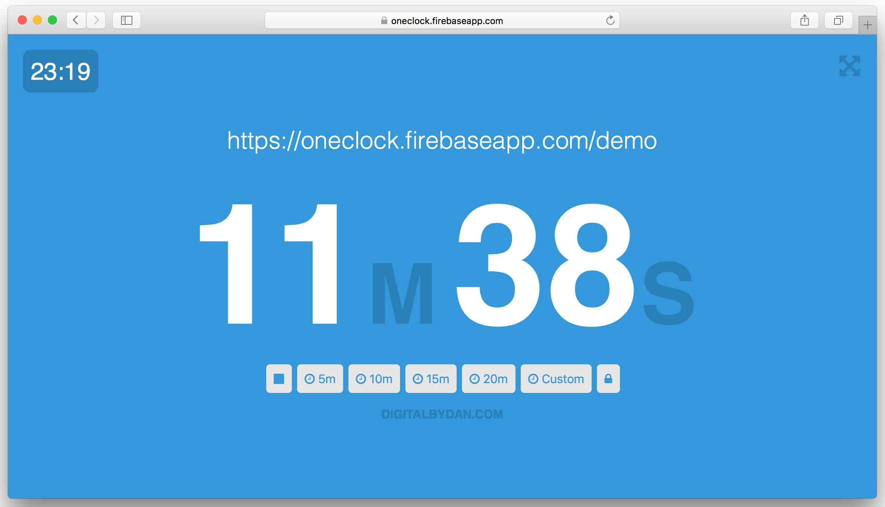

# OneClock
Create countdown timers that are synchronised in real-time across unique shareable URLs. Built originally for use at a conference for sharing speaker timings across the compère and AV staff.



## How it works
The project has been built in React making use of Firebase to provide the real-time synchronous functionality.

## Configuration
Run *npm install* to get the dependencies.

Create a [firebase app](https://firebase.google.com) and set the database rules to public for read/write. You should then add your database credentials to an *.env* file in the root of the project. These credentials can be found from clicking 'add firebase to your web app' from the overview board of your newly created Firebase app.

OneClock makes use of the dotenv environment file loading that comes preconfigured from *create-react-app*. As such the environment variables need to be prefixed with *REACT_APP_* and thus the environment file will look like the following.
``` text
REACT_APP_FB_API_KEY=
REACT_APP_FB_DATABASE_URL=
```

## Deploying
After building for production through *npm run build* the application is ready to be deployed to a webhost. The easiest host is Firebase using their [firebase-tools](https://firebase.google.com/docs/hosting/deploying) CLI.

## Commands
``` bash
# install dependencies
npm install

# start webpack in development mode
npm run start

# build for production
npm run build

# deploy to firebase
firebase deploy
```
